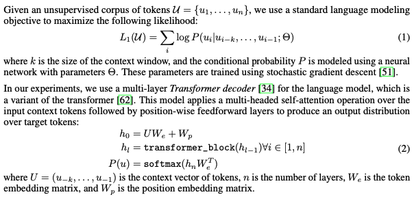
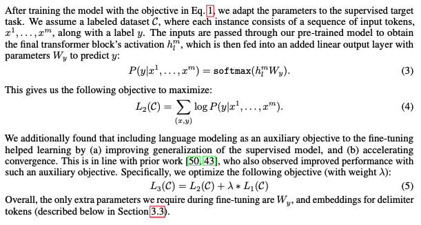
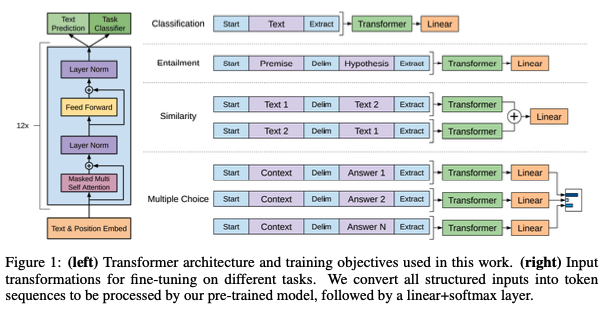

# Paper Summary: [Improving Language Understanding by Generative Pre-Training](https://s3-us-west-2.amazonaws.com/openai-assets/research-covers/language-unsupervised/language_understanding_paper.pdf)

## Abstract
- NLU comprises tasks like textual entailment, AQ, semantic similarity assessment, document classification, etc.
- lack of large labeled corpus for discriminative tasks
- came up with a pre-training approach using large unlabelled corpus and then followed by discriminative task fine-tuning with task-aware input transformation
- minimal changes to the model architecture are needed to outperform task-specific SOTAs in 9 out of 12 tasks researched

## Introduction
- unsupervised-learning approach in NLP provides huge benefits in domains:
  - where labeled corpus costs a fortune
  - that have experienced performance improvement using pre-trained word embeddings
- but word-level optimization is challenging in that:
  - it's hard to find the optimal objectives for transfer learning in general
  - there's no consensus on how to transfer pre-trained embeddings to target tasks
    in an effective way
- took a semi-supervised approach with the following set-up:
  - language modeling on unlabeled corpora
  - fine-tuning on different tasks with supervised objectives
- picked the Transformer architecture for well-known strong performance
- transfer learning with task-specific input adaptations instead of architecture change
- evaluated on 4 NLU tasks(NLI, QA, SS, TC) and zero-shot behavior analysis

## Related Work
- semi-supervised learning for NLP
  - basically semi-supervised = labelled(supervised) + unlabelled(unsupervised)
  - many attempts to utilize word/phrase-level statistics as features(ex. CBOW,
    Skip-gram, etc)
  - even higher-level text embedding of phrase/sentence-level for various target
    tasks(ex. sentence classification)
- unsupervised pre-training
  - has a goal to find a good starting point instead of optimality for specific tasks
  - acts as a regularization scheme(suppressing overfitting)
  - some previous approaches with LSTM LM pre-training + supervision-task fine-tuning,
    LM-generated word vectors + supervision-task fine-tuning all outperformed by GPT1
- Auxiliary training objectives
  - alternatives to add auxiliary NLP tasks like POS tagging/chunking/NER/LM/etc
  - not that effective considering that LM already learns many linguistic information

## Framework
- unsupervised pre-training

- supervised fine-tuning

- task-specific input transformations
  - convert structured inputs into an ordered sequence of tokens that GPT1 can process using:
    - \<s\> as start token, \<e\> as end token, $ as delimiter between input components
  - tasks requiring input transformation:
    - textual entailment: \<s\> + p(premise) + $ + h(hypothesis) + \<e\>
    - similarity: \<s\> + text1 + $ + text2 + \<e\>, \<s\> + text2 + $ + text1 + \<e\>
    - QA and commonsense reasoning:
      \<s\> + context doc z + question q + $ + a possible answer a_k + \<e\>

## Transformer Decoder Part + Training Objectives

