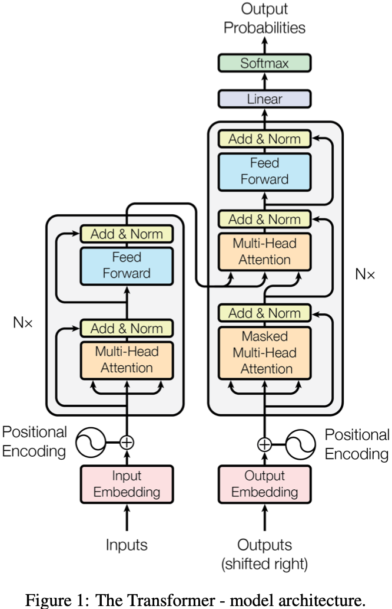
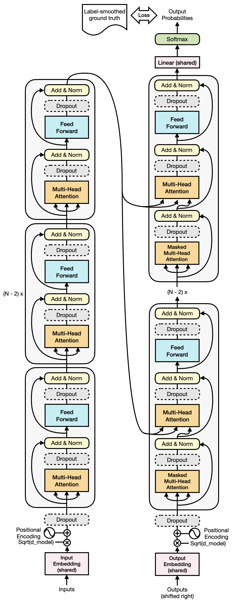
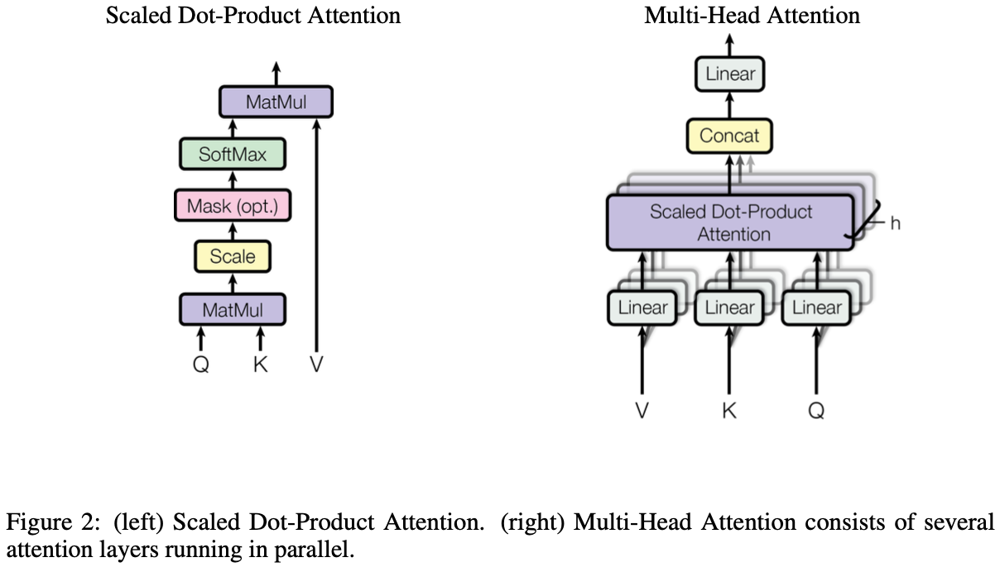
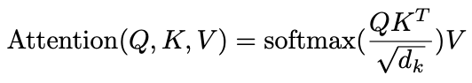
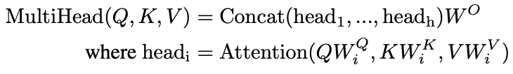
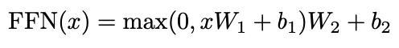
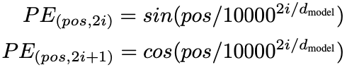
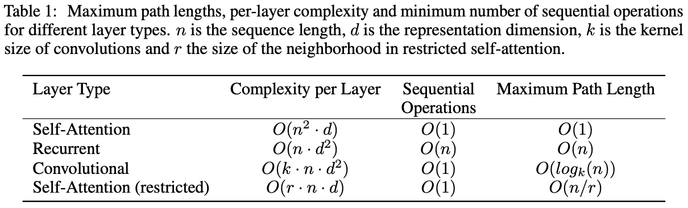
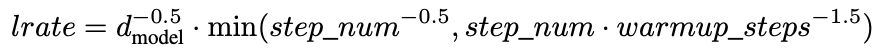

# paper summary: [Attention Is All You Need](https://arxiv.org/pdf/1706.03762.pdf)

#### Disclaimer
- it's a brief and rough summary for the original paper

## model architecture

### encoder-decoder paring in brief

### transformer architecture in more details

- in each encoder and decoder layer, the self-attention enables for each position to attend to all positions in principle
- it implements the seq-to-seq transduction masking all positions rightward of the current step in the decoder layers
- the topmost encoder output acts as the keys & values entering into each decoder layer

### scaled dot-product and multi-head attention

#### scaled dot-product attention

- the commonly used attention method since [NMT by jointly learning to align and translate](https://arxiv.org/pdf/1409.0473.pdf)
- it deals with the inner-product magnitude scale problem of large-sized vectors by introducing a scaling factor(1/sqrt(d_k))
- computationally cheaper than additive attention with appropriate application of a scaling factor as practical heuristic

#### multi-head attention

- it provides with multiple attention results using different parallel 'scaled dot-product attention' heads
- and it has a compute load almost the same as that of a single head attention with the full dimensionality
- a brilliant choice for both general performance regularity and computational efficiency

### position-wise feed-forward networks

- each layer in the encoder/decoder has a feed forward network with parameters shared across positions but unique per layer

### embeddings and softmax
- the same matrix is shared between the input/output embedding layers and the pre-softmax linear transformation
- and multiply those embedding layer weights by sqrt(d_model)

### positional encoding

- sinusoidal functions are used to inject the sequence order information to help the model learn to attend by relative positions
- any position with some fixed offset k, PE_(pos+k), can be represented as a linear function of PE_pos

## why self-attention

- complexity per layer
  - self-attention layer has less computational complexity than recurrent layer if n is less than d which is most often the case
  - self-attention layer has much less complexity than conv layer (separable convolutions have complexity between self-attention only and self-attention + FFN)
  - when n is very large, restricted self-attention could be an alternative but it increases the max path length to O(n/r)
- sequential operations
  - self-attention layer has a constant number of sequential operations as conv layer and restricted self-attention layer do while recurrent layer does the worst
- maximum path length
  - a single self-attention layer simply connects all positions to each other which no other layer type can do

## training 
- training data and batching
  - WMT 2014 English-German
    - 4.5 million sentence pairs
    - shared source/target vocab of about 37000 tokens with BPE
  - WMT 2014 English-French
    - 36 million sentence pairs
    - shared source/target vocab of about 32000 tokens with word-piece
  - sentence-pair batching of approximate sequence length
    - a set of sentence pairs with approximately 25000 source/target tokens respectively
- hardware and schedule
  - one machine with 8 P100 GPUs
  - base model
    - training step time: 0.4 seconds
    - training for 100000 steps (12 hours)
  - big model
    - training step time: 1.0 seconds
    - training for 300000 steps (3.5 days)
- optimizer
  - Adam optimizer with beta1 = 0.9, beta2 = 0.98, epsilon = 10^-9
  - learning rate varying over the course of training with warmup_steps = 4000:

- regularization
  - residual dropout
    - dropout applied in the encoder/decoder stacks to:
      - multi-head attention output before 'Add & Norm'
      - FFN output before 'Add & Norm'
      - input/output embeddings + positional encodings
    - dropout probability for the base model: 0.1
  - label smoothing
    - epsilon = 0.1
    - performance: accuracy(+), BLUE(+), perplexity(-)
## results
- refer to the original paper
