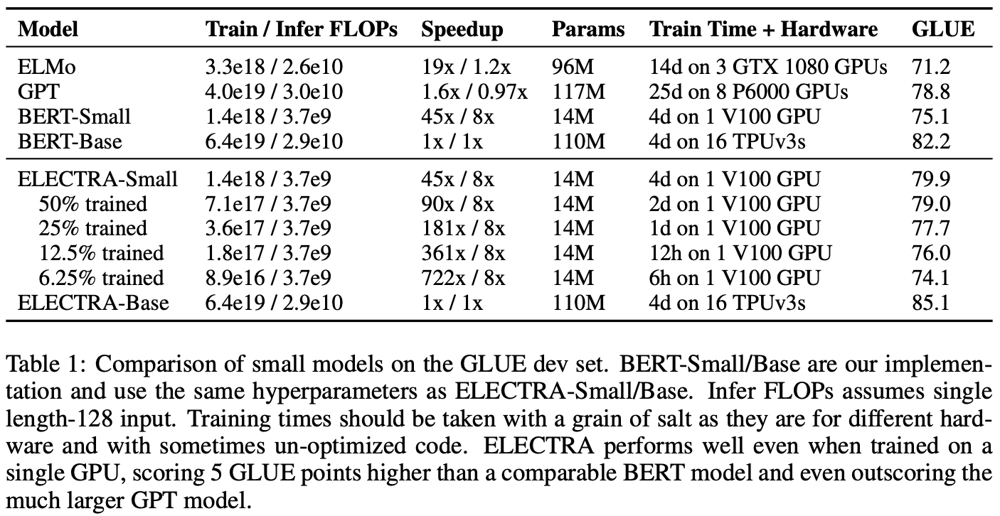
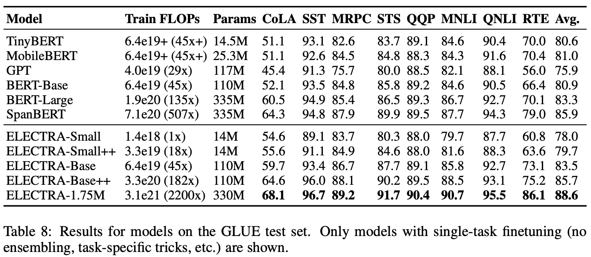
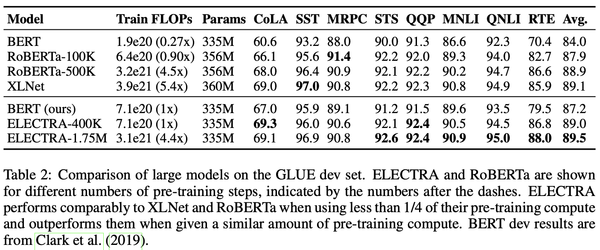
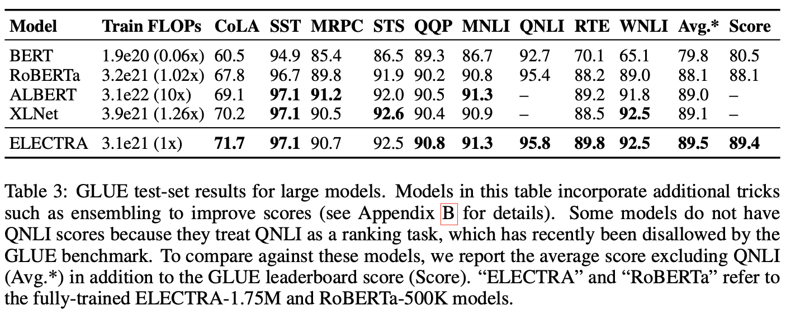
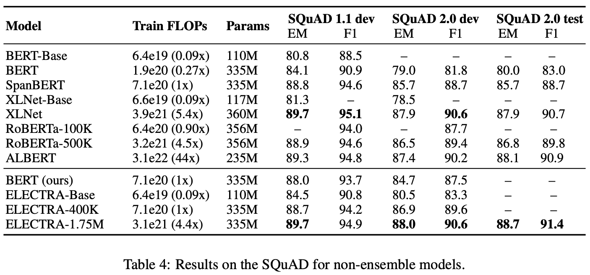
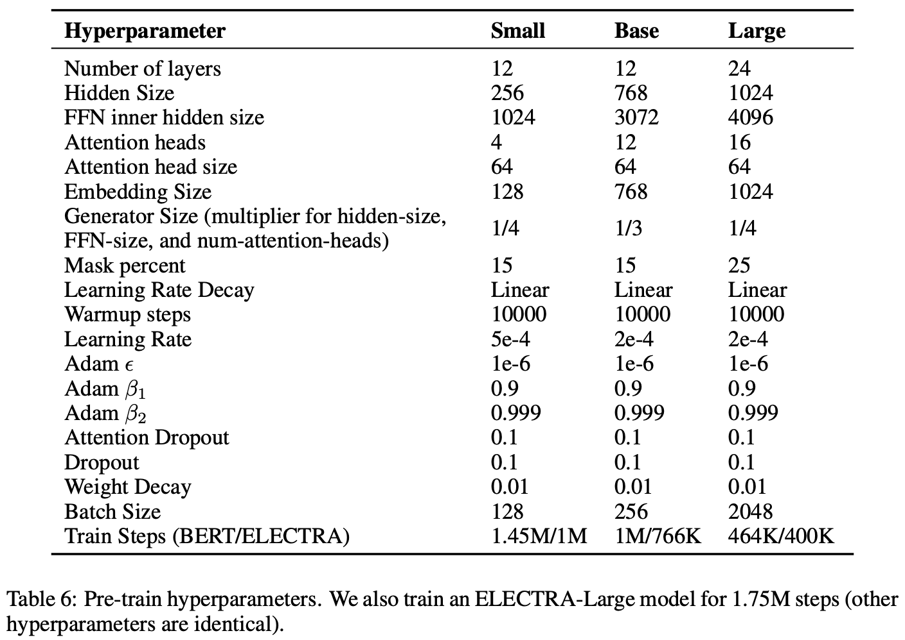
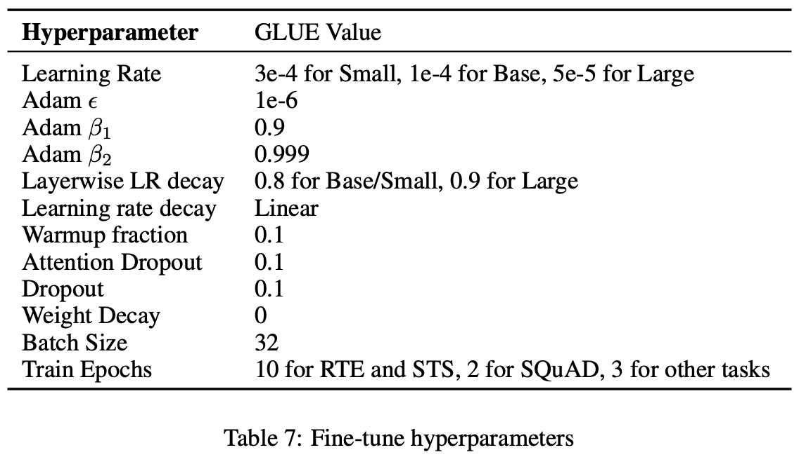

# Paper Summary: [ELECTRA: PRE-TRAINING TEXT ENCODERS AS DISCRIMINATORS RATHER THAN GENERATORS](https://arxiv.org/pdf/2003.10555.pdf)
  - [github repo(google-research/electra)](https://github.com/google-research/electra)
  - [Google Research blog post(More Efficient NLP Model Pre-training with ELECTRA)](https://ai.googleblog.com/2020/03/more-efficient-nlp-model-pre-training.html)

## Abstract
  - BERT MLM produces good results for downstream NLP tasks but quite expensive
  - replaced token detection(RTD) as an alternative for better sample/compute-efficiency
  - RTD replaces some input tokens with plausible alternatives sampled from a small generator
  - then train a discriminator to predict whether each input token was replaced or original
  - RTD, using all input tokens, is proven experimentally to be more efficient than MLM
  - RTD learns better contextual representations than BERT given the same model size/data/compute
  - a small ELECTRA model trained on 1 GPU for 4 days defeats GPT(using 30x more compute) on the GLUE benchmark
  - comparable performance with < 1/4 of compute for RoBERTa/XLNet and better with the same amount of compute

## Introduction
  - MLM exceled predecessors using bidirectional context but incurred huge compute cost(ex. 15% input masking)
  - RTD is an alternative pre-training task to train a model to distinguish real input tokens from replaced ones
    - it corrupts the input by replacing some tokens with samples from a proposal distribution like small MLM output
    - it doesn't suffer from the pre-training/fine-tuning discrepancy for the [MASK] token just as BERT does
    - then pre-train the network as a discriminator that predicts for every token if it's original or replaced
    - it's more computationally efficient than MLM to learn from all input tokens, not just a small subset
    - and the generator corrputing tokens is trained with maximum likelihood, not adversarially as for GAN
  - they call the approach ELECTRA: Efficiently Learning an Encoder that Classifies Token Replacements Accurately
    - it's shown to train much faster than BERT and achieve higher accuracy on downstream tasks when fully trained
  - they train ELECTRA models of various sizes and evaluate their downstream performance vs their compute requirement
    - experiments on the GLUE benchmark and SQuAD question answering benchmark
    - ELECTRA outperforms MLM-based BERT/XLNet given the same model size/data/compute(Figure 1)
    - ELECTRA-Small, trained on 1 GPU in 4 days, beats a small BERT by 5 GLUE points and a much larger GPT model
    - ELECTRA-Large, with fewer params and 1/4 of training compute, matches RoBERTa/XLNet comparably
    - training ELECTRA-Large further even defeats ALBERT on GLUE and sets a new SOTA for SQuAD 2.0
  - in total, RTD is more compute/param-efficient than MLM-based methods for language representation learning

## Method

  - ELECTRA approach trains 2 transformer encoder stacks: G(generator) and D(discriminator)
  - both map an input token seq **x** = [x1,...,xn] into a context vector reps seq h(**x**) = [h1,...,hn]
  - for xt = [MASK], G outputs a probability for generating a particular token xt with a softmax layer:

  - 'e' denotes token embeddings
  - for a position 't', D predicts if the token xt is original or replaced with a sigmoid output layer:

  - G is trained to perform masked language modeling(MLM)
  - D is trained to distinguish tokens in the data from tokens replaced by G samples
  - model inputs are constructed according to:

  - and the loss functions:

  - although similar to the GAN training objective, there are several key differences:
    - if G generates the correct token, that token is considered 'real' instead of 'fake'
    - G is trained with maximum likelihood rather than being trained adversarially to fool D
      - applying GAN to text is hard as it's impossible to back-propagate through sampling from G
      - detouring this with reinforcement learning to train G performed worse than maximum-likelihood training
    - G doesn't get a noise vector as input which is typical for a GAN
  - so we minimize the combined loss over a large corpus X of raw text:
    - approximate the expectations in the losses with a single sample
    - don’t back-propagate the D loss through G(impossible due to the G sampling step)

  - after pre-training, we throw out G and fine-tune D on downstream tasks

## Experiments
### Experimental Setup
  - evaluate on the GLUE benchmark and SQuAD dataset
    - GLUE: RTE, MNLI, QNLU, MRPC, QQP, STS, SST, CoLA
    - SQuAD: text span selection for question answering(SQuAD 1.1) + unanswerability beyond 1.1(SQuAD 2.0)
    - evaluation metrics: Spearman correlation/Mathews correlation/accuracy for GLUE, Exact Match/F1 for SQuAD
  - pre-train on the same data as BERT for most experiments consisting of 3.3B tokens from Wikipedia + BooksCorpus
    - for ELECTRA-Large pre-train on XLNet data extending the BERT dataset to 33B tokens(ClueWeb/CommonCrawl/Gigaword)
  - the same model architecture and most hyper-params as BERT's
    - simple linear classifiers on top of ELECTRA for fine-tuning on GLUE
    - question-answering module from XLNet on top of ELECTRA from SQuAD 1.1 & 2.0('answerability' classifier added)
  - some evaluation datasets are small enough to incur substantial variance by the random seed
    - report the median of 10 fine-tuning runs from the same pre-trained checkpoint for each result
    - results are on the dev set by default
### Model Extensions
  - experiments use the same model size and training data as BERT-Base by default
#### Weight Sharing
  - weight tying experiments with 500k steps for pre-training efficiency when G and D have the same size:
    - no weight tying: 83.6 GLUE points, token-embeddings tying: 84.3, all-weights tying: 84.4
    - tied token embeddings enable efficient representation learning with G's softmax over all vocab for each step
    - but tying all weights shows little improvement while requiring G and D to be the same size with almost no gain
  - so they use tied embeddings only for further experiments in the paper
#### Smaller Generators
  - G and D of different sizes are shown in Figure 3(with all models trained for 500k steps)
  - smaller Gs require less compute per step but models work best with Gs 1/4~1/2 the size of D
  - it seems like a too strong G may pose a too-challenging task that prevents D from learning effectively
  - further experiments in this paper use the best G size found for the given D size

#### Training Algorithms
  - they explore training methods other than the proposed joint training
  - (A) 2-stage training
    - procedure(provided both G and D have the same size)
      - step 1: train only G with LMLM for n steps
      - step 2: initialize the D weights with G's; then train D with LDisc for n steps, keeping G frozen
    - without the weight initialization, D sometimes fails to learn at all beyond the majority class
    - it eventually fails to outperform the joint training which helps D to catch up the progress of G
  - (B) adversarial training
    - train G adversarially as in a GAN using RL to walk around the G sampling step issue
    - it outperforms BERT but fails to defeat the MLE methods in the end for these adversarial training problems:
      - 1: the adversarial G is simply worse at MLM; only 58% accuracy while 65% for an MLE-trained G
      - 2: the adversarial G produces a low-entropy output distribution with most of the probability mass on 1 token
### Small Models

  - they develop a small model(for 1M steps), trainable on 1 GPU, to improve pre-training efficiency
  - reduce the model size starting from BERT-base hyper-params:
    - seq. len(512->128), batch size(256->128), hidden dimension(768->256), token embeddings(768->128)
  - vs BERT-Small for fair comparison(with the same hyper-params, trained for 1.5M steps)
  - vs ELMo and GPT(for comparison with other resource-efficient models)
  - ELECTRA-Base vs BERT-Base
  - stronger small-sized and base-sized models trained with more compute

### Large Models
  - they train big ELECTRA models to measure the effectiveness of RTD pre-training @ 2020 SOTA txfmr scales
  - ELECTRA-Large models are the same size as BERT-Large but are trained for much longer
  - batch size 2048 and the XLNet pre-training data
  - ELECTRA-400K performs comparably to RoBERTa/XLNet with less than 1/4 pre-training compute
  - training ELECTRA for longer(ELECTRA-1.75M) results in a model beating them on most GLUE tasks with less compute

  - ELECTRA scores better than MLM-based methods given the same compute resource

### Efficiency Analysis
  - design experiments(between BERT and ELECTRA) to better understand where the gains of ELECTRA come from
#### ELECTRA 15%
  - the D loss only comes from 15% of the tokens masked out of the input
#### Replace MLM
  - the same objective as MLM except for the [MASK] tokens replaced with G samples
  - to test to what extent ELECTRA's gains come from solving the pre-training/fine-tuning discrepancy for [MASK]
#### All-Tokens MLM
  - do the same as 'Replace MLM' but over all input tokens
  - it improves the result to train this model with an explicit copy mechanism
    - a copy probability D for each token using a sigmoid layer
    - model output: D(**ELECTRA**) * (input token) + (1 - D)(**ELECTRA**) * (MLM softmax(**BERT**))
    - if without G sample replacement, the model would trivially learn MLM for [MASK] and copy the input otherwise

  - these results suggest a large amount of ELECTRA’s improvement can be attributed to learning from all tokens
  - and a smaller amount can be attributed to alleviating the pre-train fine-tune mismatch

  - the gains from ELECTRA grow larger as the models get smaller
  - ELECTRA achieves higher downstream accuracy than BERT when fully trained
    - they argue ELECTRA to be more parameter-efficient than BERT
    - because it doesn't have to model the full distribution of possible tokens at each position
    - **more analysis is needed to completely explain ELECTRA's parameter efficiency(they don't know, either).**

## Related Work
### Self-Supervised Pre-training for NLP
  - for word representations
    - Word2Vec, GloVe, etc.
  - and language modeling
    - BERT/MASS/UniLM/ERNIE/SpanBERT/XLNet/TinyBERT/MobileBERT/etc.
### Generative Adversarial Networks
  - effective at generating high-quality synthetic data
  - been applied to text data, though falling behind standard MLE
  - MaskGAN seemingly alike with a generator to fill in the deleted input tokens
### Contrastive Learning
  - learn to distinguish real from negative(fake) samples in multi-modalities
  - ELECTRA is particularly related to Noise-Contrastive Estimation(NCE)
    - can be viewed as a massively scaled-up Continous Bag-of-Words(CBOW)
    - reminiscent to predict an input token given surrounding context
    - and negative sampling renders the learning task as a binary cls(real vs fake)
    - but differs with  bag-of-vectors from unigram dist. vs transformer encoder

## Conclusion
  - RTD as a self-supervised task for language representation learning
  - to train a text encoder to distinguish original input tokens from negative samples
  - RTD is more data/downstream-task efficient than MLM
  - the writers hope ELECTRA will make pre-training large models more accessible
  - NLP pre-training needs to focus on compute-efficiency as well as absolute performance

--------------------------------------------------------------------------------------------

## Pre-Training Details
  - the following details apply both to ELECTRA and BERT baselines
    - hyper-params mostly the same as BERT
    - λ(the discriminator objective weight in the loss) set to 50
    - dynamic token masking(different masking pattern for every input seq)
    - no NSP(who the heck would use it?)
    - 25% of masking(not 15%) for ELECTRA-Large to lower the generator accuracy
    - the best learning rate for the Base/Small models picked out of [1e-4, 2e-4, 3e-4, 5e-4]
    - and λ out of [1, 10, 20, 50, 100] in early experiments

## Fine-Tuning Details

