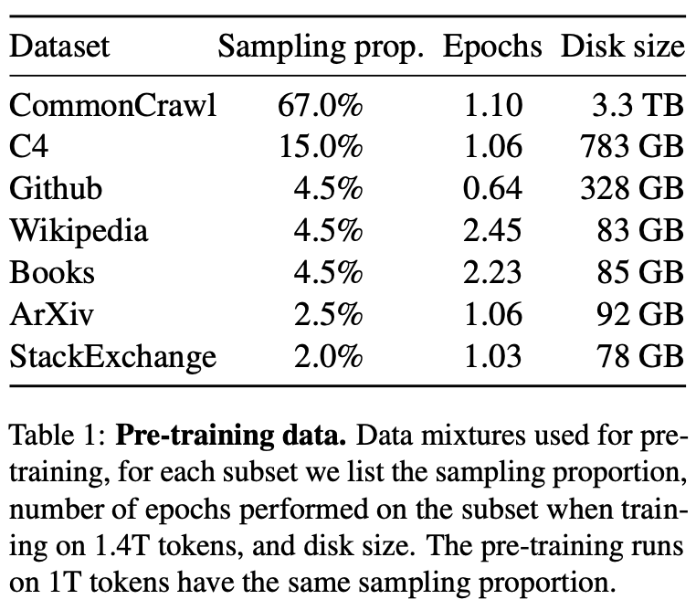
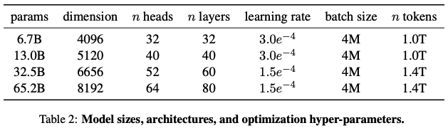

# Paper Summary: [LLaMA: Open and Efficient Foundation Language Models](https://arxiv.org/pdf/2302.13971.pdf)

## Abstract
  - LLaMA: a collection of foundation LMs (7B/13B/33B/65B)
  - trained on trillions of tokens from publicly available datasets only
  - benchmarks performance: LLaMA-13B > GPT3-175B, LLaMA-65B > Chinchilla-70B & PaLM-540B
  - https://github.com/facebookresearch/llama

## Introduction
  - smaller models trained on more data > lager models trained on less
    - LLMs based on the assumption that more parameters will lead to better performance: GPT3-175B/PaLM-540B/Gopher-280B/etc.
    - but best performances are achieved by smaller models trained on more data: Chinchilla-70B
    - while Chinchilla focuses on the training budget, the inference budget really matters when serving at scale
    - so not the fastest to train but the fastest at inference for a given target level of performance
  - LLaMA focues on:
    - the best possible performance for limited inference budget
      - LLaMA-13B > GPT-3 on most benchmarks though being 13X smaller
      - LLaMA-65B ~= Chinchilla or PaLM-540B
    - publicly available open-source-compatible data
      - most existing LLMs rely on not publicly available or undocumented data
      - while some exceptions(OPT/GPT-NeoX/BLOOM/GLM) exist but they perform worse than PaLM-62B/Chinchilla
  - what follows:
    - transformer architecure modifications
    - training method
    - performance of LLaMAs vs other LLMs
    - biases/toxicity in LLaMA

## Approach
  - similar approach for GPT3/PaLM
  - inspired by the Chinchilla scaling laws
  - large transformers trained on large corpora with standard optimizer
### Pre-training Data
  - publicly available & open-source-compatible data only
  - reuse data sources leveraged for existing LLMs

  - English CommonCrawl [67%]
    - line-level-deduplication + language ID/n-gram LM for non-English/low-quality corpus removal
    - use a linear classifier for Wikipedia reference pages only
  - C4 [15%]
    - a large, cleaned version of Common Crawl's web crawl corpus(publicly available & diverse)
    - deduplication + language ID + heuristics(punctuation marks/number of words and sentences/etc.)
  - Github [4.5%]
    - Google BigQuery GitHub projects under Apache/BSD/MIT licenses
    - heuristics + boilerplate removal + file-level-deduplication
  - Wikipedia [4.5%]
    - dumps from June~August 2022 of 20 languages using Latin/Cyrillic scripts
    - removal of hyperlinks/comments/boilerplates
  - Gutenberg and Books3 [4.5%]
    - Gutenberg Project for books in the public domain and Books3 section of ThePile(publicly available corpus)
    - book-level-deduplication for 90+% content overlap books
  - ArXiv [2.5%]
    - for scientific data in Latex files
    - removal of the first section/bibliography/comments and inline-expansion
  - Stack Exchange [2%]
    - a high quality QA data dump ranging from computer science to chemistry
    - data from 28 largest websites + removal of HTML tags + sorting of answers by score
  - Tokenizer
    - BPE implementation of Sentence-Piece
    - splitting all numbers into individual digits + fallback to bytes to decompose unknown UTF-8 characters
  - training dataset of 1.4T tokens after tokenization
  - mostly each token is used only once during training, except for Wikipedia and Books domains(with about 2 epochs)
### Architecture
  - based on transformer with following differences inspired from LLMs in bracket:
    - Pre-normalization [GPT3]
      - transformer sub-layer input, instead of output, normalization using RMSNorm for training stability
    - SwiGLU activation function [PaLM]
      - SwiGLU instead of ReLU non-linearity
    - Rotary Embeddings [GPTNeo]
      - rotary positional embeddings, instead of absolute positional embeddings, at each layer of the network

### Optimizer
  - AdamW optimizer with $\beta$1 = 0.9 and $\beta$2 = 0.95
  - cosine learning rate schedule with the final learning rate equal to 10% of max learning rate
  - weight decay = 0.1, gradient clipping = 1.0, warmup steps = 2000
  - vary the learning rate and batch size with the size of the model (table 2)
### Efficient implementation
  - causal multi-head attention improvement(to skip computation over the masked region) to reduce memory usage and runtime
  - save only expensive activations to compute using manual implementation of the backward function, not pytorch autograd
    - model/sequence parallemism
    - computation overlap of activations and the communication between GPUs over the network as much as possible
  - LLaMA-65B training on 1.4T tokens takes about 21 days with 2048 A100 80GB, processing around 380 tokens/sec/GPU

## Main results
  - TBD
### Common Sense Reasoning
  - TBD (table 3)
### Closed-book Question Answering
  - TBD (table 4 & 5)
### Reading Comprehension
  - TBD (table 6)
### Mathematical reasoning
  - TBD (table 7)
### Code generation
  - TBD (table 8)
### Massive Multitask Language Understanding
  - TBD (table 9)
### Evolution of performance during training
  - TBD (figure 1 & 2)

## Instruction Finetuning
  - TBD (table 10)

## Bias, Toxicity and Misinformation
  - TBD
### RealToxicityPrompts
  - TBD (table 11)
### CrowS-Pairs
  - TBD (table 12)
### WinoGender
  - TBD (table 13)
### TruthfulQA
  - TBD (table 14)

## Carbon footprint
  - TBD (table 15)

## Related work
  - Language models
    - TBD
  - Architecture
    - TBD
  - Scaling
    - TBD

## Conclusion
  - TBD