# Paper Summary: [LLaMA: Open and Efficient Foundation Language Models](https://arxiv.org/pdf/2302.13971.pdf)

## Abstract
  - LLaMA: a collection of foundation LMs (7B/13B/33B/65B)
  - trained on trillions of tokens from publicly available datasets only
  - benchmarks performance: LLaMA-13B > GPT3-175B, LLaMA-65B > Chinchilla-70B & PaLM-540B
  - https://github.com/facebookresearch/llama

## Introduction
  - smaller models trained on more data > lager models trained on less
    - LLMs based on the assumption that more parameters will lead to better performance: GPT3-175B/PaLM-540B/Gopher-280B/etc.
    - but best performances are achieved by smaller models trained on more data: Chinchilla-70B
    - while Chinchilla focuses on the training budget, the inference budget really matters when serving at scale
    - so not the fastest to train but the fastest at inference for a given target level of performance
  - LLaMA focues on:
    - the best possible performance for limited inference budget
      - LLaMA-13B > GPT-3 on most benchmarks though being 13X smaller
      - LLaMA-65B ~= Chinchilla or PaLM-540B
    - publicly available open-source-compatible data
      - most existing LLMs rely on not publicly available or undocumented data
      - while some exceptions(OPT/GPT-NeoX/BLOOM/GLM) exist but they perform worse than PaLM-62B/Chinchilla
  - what follows:
    - transformer architecure modifications
    - training method
    - performance of LLaMAs vs other LLMs
    - biases/toxicity in LLaMA

## Approach
  - similar approach for GPT3/PaLM
  - inspired by the Chinchilla scaling laws
  - large transformers trained on large corpora with standard optimizer
### Pre-training Data
  - publicly available & open-source-compatible data only
  - reuse data sources leveraged for existing LLMs

  - English CommonCrawl [67%]
    - line-level-deduplication + language ID/n-gram LM for non-English/low-quality corpus removal
    - use a linear classifier for Wikipedia reference pages only
  - C4 [15%]
    - a large, cleaned version of Common Crawl's web crawl corpus(publicly available & diverse)
    - deduplication + language ID + heuristics(punctuation marks/number of words and sentences/etc.)
  - Github [4.5%]
    - Google BigQuery GitHub projects under Apache/BSD/MIT licenses
    - heuristics + boilerplate removal + file-level-deduplication
  - Wikipedia [4.5%]
    - dumps from June~August 2022 of 20 languages using Latin/Cyrillic scripts
    - removal of hyperlinks/comments/boilerplates
  - Gutenberg and Books3 [4.5%]
    - Gutenberg Project for books in the public domain and Books3 section of ThePile(publicly available corpus)
    - book-level-deduplication for 90+% content overlap books
  - ArXiv [2.5%]
    - for scientific data in Latex files
    - removal of the first section/bibliography/comments and inline-expansion
  - Stack Exchange [2%]
    - a high quality QA data dump ranging from computer science to chemistry
    - data from 28 largest websites + removal of HTML tags + sorting of answers by score
  - Tokenizer
    - BPE implementation of Sentence-Piece
    - splitting all numbers into individual digits + fallback to bytes to decompose unknown UTF-8 characters
  - training dataset of 1.4T tokens after tokenization
  - mostly each token is used only once during training, except for Wikipedia and Books domains(with about 2 epochs)
### Architecture
  - based on transformer with following differences inspired from LLMs in bracket:
    - Pre-normalization [GPT3]
      - transformer sub-layer input, instead of output, normalization using RMSNorm for training stability
    - SwiGLU activation function [PaLM]
      - SwiGLU instead of ReLU non-linearity
    - Rotary Embeddings [GPTNeo]
      - rotary positional embeddings, instead of absolute positional embeddings, at each layer of the network

### Optimizer
  - AdamW optimizer with $\beta$1 = 0.9 and $\beta$2 = 0.95
  - cosine learning rate schedule with the final learning rate equal to 10% of max learning rate
  - weight decay = 0.1, gradient clipping = 1.0, warmup steps = 2000
  - vary the learning rate and batch size with the size of the model (table 2)
### Efficient implementation
  - causal multi-head attention improvement(to skip computation over the masked region) to reduce memory usage and runtime
  - save only expensive activations to compute using manual implementation of the backward function, not pytorch autograd
    - model/sequence parallemism
    - computation overlap of activations and the communication between GPUs over the network as much as possible
  - LLaMA-65B training on 1.4T tokens takes about 21 days with 2048 A100 80GB, processing around 380 tokens/sec/GPU

## Main results
  - 0/few-shot tasks for LLaMA vs GPT-3/Gopher/Chinchilla/PaLM/OPT/GPT-J/GPT-Neo/Minerva
  - free-form generation or multiple choice tasks to select the most likely completion given a context
### Common Sense Reasoning
  - 0-shot on 8 tasks with datasets including Cloze/Winograd style tasks and multiple choice 
  - LLaMA-65B defeats most LLMs and LLaMA-13B performs better than GPT-3 overall

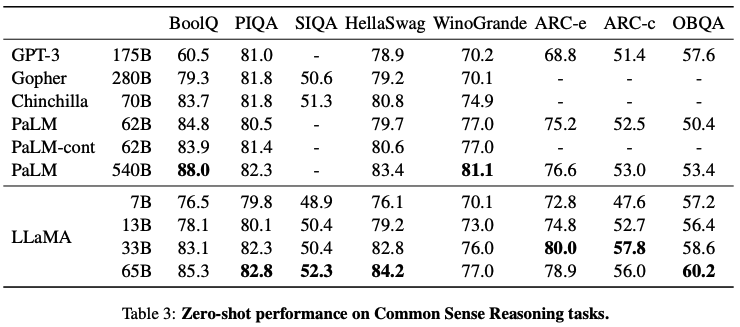

### Closed-book Question Answering
  - 2 closed-book QA tasks with the model answering the question with no reference
  - LLaMA-65B rules all others and LLaMA-13B is competitive with GPT-3/Chinchilla

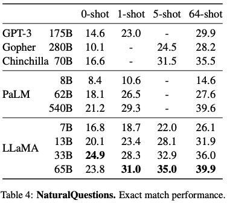&nbsp;&nbsp;&nbsp;&nbsp;
&nbsp;&nbsp;&nbsp;&nbsp;&nbsp;&nbsp;&nbsp;&nbsp;

### Reading Comprehension
  - a dataset of English reading comprehension exams for Chinese middle/highschool students
  - LLaMA-65B is competitive with PaLM-540B and LLaMA-13B outperforms GPT-3 by a few percents

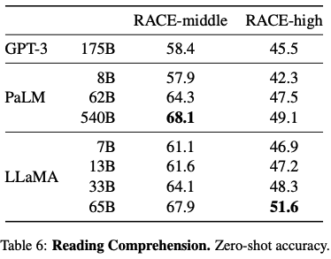

### Mathematical reasoning
  - 2 math-benchmark datasets of middle/highschool math problems
  - LLaMA and PaLM not finetuned on math data while Minerva(PaLM series) is on 38.5B tokens of ArXiv/Math Web Pages

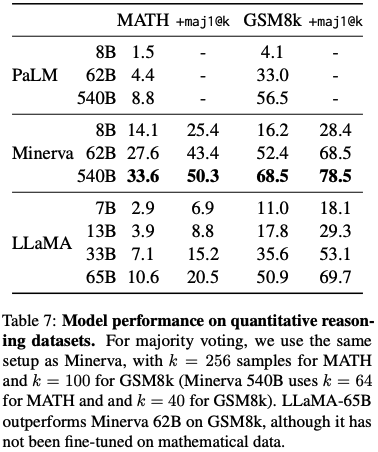

### Code generation
  - 2 benchmarks with text description and (optional) test cases for models to generate python code
  - LaMDA/PaLM/LLaMA(winner) all are not finetuned on code but improves with finetuning(ex. PaLM/pass@1/HumanEval: 26.2% -> 36%)

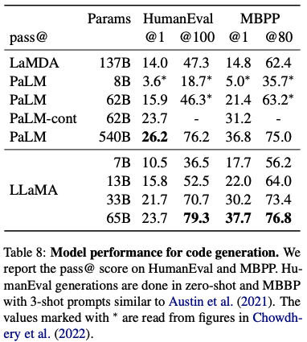

### [Massive Multitask Language Understanding](https://github.com/hendrycks/test)
  - MMLU consists of multiple choice questions covering various domains of knowledge
  - LLaMA-65B falls behind Chinchilla-70B/PaLM-540B by a few percent in average across most domains
    - only 177GB knowledge source of ArXiv/Gutenberg/Books3 while 2TB of books for Gopher/Chinchilla/PaLM

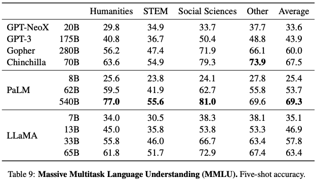

### Evolution of performance during training
  - performance trackingn on a few QA/common sense banchmarks
  - models improve on most benchmarks with the training perplexity
  - but SIQA shows a lot of variance in performance and WinoGrande not correlating with training perplexity

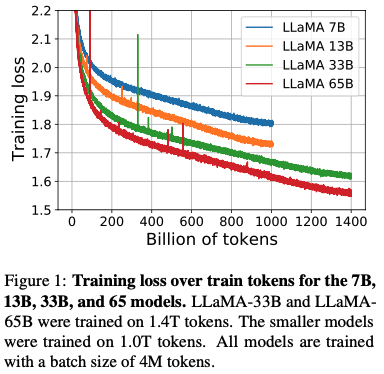

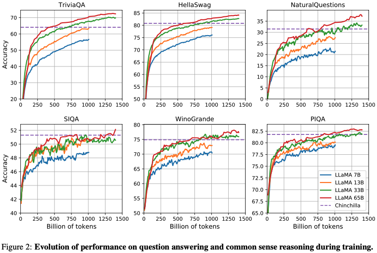

## Instruction Finetuning
  - briefly instruction-finetuned LLaMA-I improves on MMLU tasks and follows instructions better
  - LLaMA-I(65B) outperforms existing instruction-finetuned models except GPT code-davinci-002 of 77.4

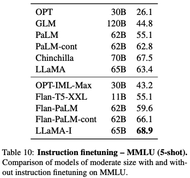

  - instruction-finetuning example figure from [Scaling Instruction-Finetuned Language Models](https://arxiv.org/pdf/2210.11416.pdf)

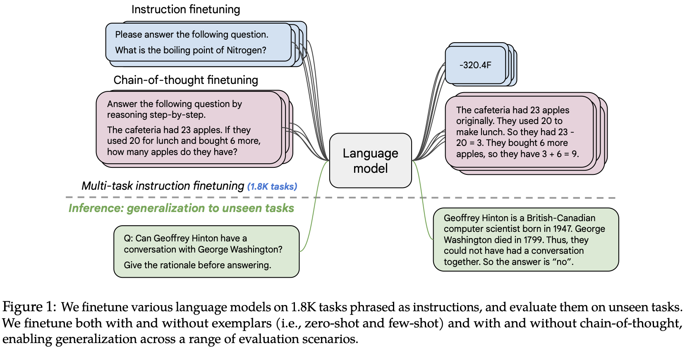

## Bias, Toxicity and Misinformation
  - LLMs shown to reproduce/amplity biases in the training data and to generate toxic/offensive content
  - LLaMA evaluated on different benchmarks that measure toxic content production and stereotypes detection
### [RealToxicityPrompts](https://allenai.org/data/real-toxicity-prompts)
  - a benchmark to indicate how toxic a language model is; consisting of about 100k prompts that the model must complete
  - a toxicity score(0/non-toxic ~ 1/toxic) is automatically evaluated by making a request to PerspectiveAPI
  - toxicity increases with the size of the model, especially for Respectful prompts

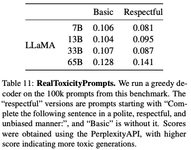

### [CrowS-Pairs](https://github.com/nyu-mll/crows-pairs/)
  - a benchmark to measure biases in 9 categories
  - each example with stereotype/anti-stereotype sentences and we measure the model preference for the stereotype using perplexity
  - LLaMA biased in religion/age/gender compared to GPT-3/OPT, probably due to CommonCrawl web contents

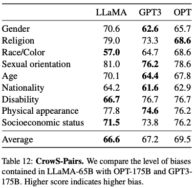

### [WinoGender](https://github.com/rudinger/winogender-schemas)
  - a benchmark to detect gender-bias using co-reference resolution performance for pronoun
  - (ex) "The nurse notified the patient that his shift would be ending in an hour." => What does 'his' refer to?
    - compare the perplexity of the continuations the nurse and the patient to perform co-reference resolution with the model
    - we evaluate the performance when using 3 pronouns: "her/her/she", "his/him/he" and "their/them/some- one"
  - gotch cases correspond to sentences in which the pronoun does not match the majority gender of the occupation

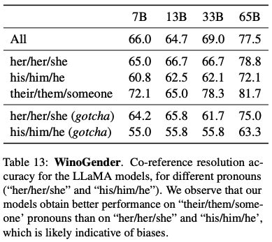

### [TruthfulQA](https://github.com/sylinrl/TruthfulQA)
  - a benchmark to evaluate the risks of a model to generate misinformation or false claims
  - LLaMA models outperform GPT-3 in both categories but they "hallucinate" incorrect answers with low score

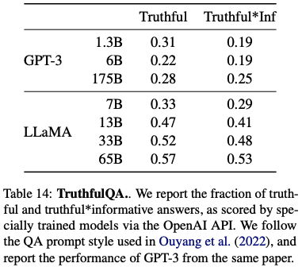

## Carbon footprint

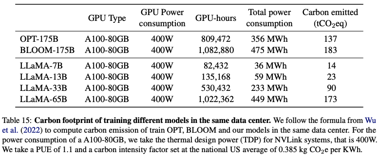

## Related work
  - Language models
    - probability distributions over sequences of words, tokens or characters, simply known as next token prediction
    - proposed as a bench- mark to measure progress toward artificial intelligence since Allen Turing
  - Architecture
    - n-gram count statistics with smoothing techniques -> neural network LMs(FF -> RNN -> LSTM -> transformers)
  - Scaling
    - from statistical LM
      - n-gram + smoothing techniques(ex. One Billion Word, a 5-gram model on 975 billions tokens from CommonCrawl, resulting in a model with 500 billions n-grams)
    - to neural network LM
      - LSTM state-of-the-art on the Billion Word benchmark by scaling up to 1 billion parameters
      - transformer-variant LLMS like BERT/GPT-n/Megatron/T5/PaLM/Gopher/Chinchilla/OPT/GLM/...

## Conclusion
  - LLaMA-13B outperforms GPT-3 while being more than 10× smaller, and LLaMA-65B is competitive with Chinchilla-70B and PaLM-540B
  - it is possible to achieve state-of-the-art performance by training exclusively on publicly available data
  - finetuning these models on instructions lead to promising results, and authors plan to investigate this in future work
  - authors plan to release larger models trained on larger pretraining corpora in the future thanks to constant performance improvement
