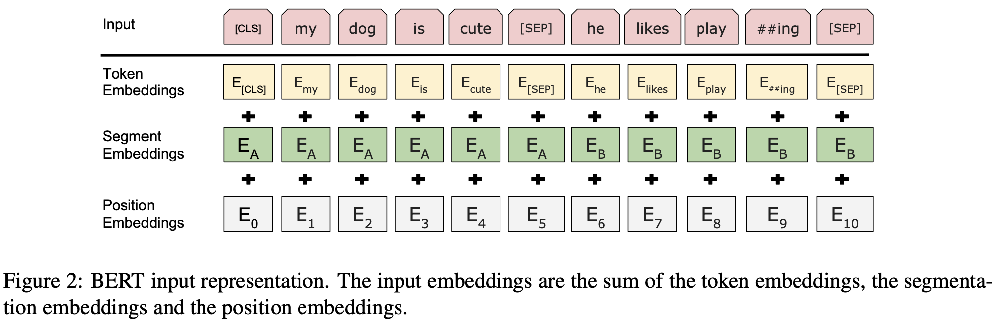
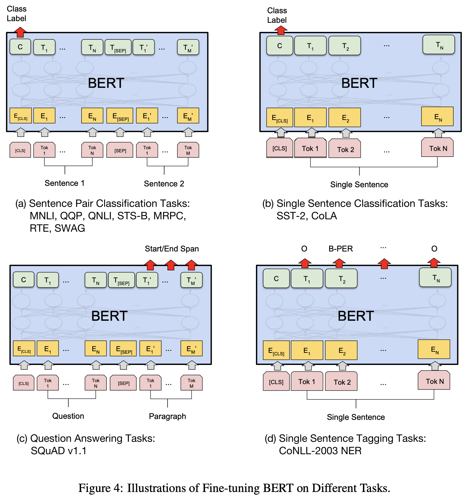

# Paper Summary: [BERT: Pre-training of Deep Bidirectional Transformers for Language Understanding](https://arxiv.org/pdf/1810.04805.pdf)

## Abstract
- BERT: Bidirectional Encoder Representations from Transformers
- trained using left/right contexts altogether, different from GPT1
- required only an additional output layer for various downstream tasks
- almost no need to modify the model architecture itself
- new SOTAs on 11 NLP tasks like GLUE/MultiNLI/SQuAD v1.1 QA test f1/SQuAD v2.0 test f1

## Introduction
- LM pre-training shown to be beneficial for sentence/token-level tasks(NLI, paraphrasing, NER, QA, etc.)
- 2 existing strategies of ELMo(feature-based) and GPT(fine-tuning) suffer from unidirectional learning
- BERT employs the MLM(masked language modeling) technique to fully utilize context in both directions
- and also use the NSP(next sentence prediction) task to jointly pre-train text-pair representations
- in short, bidirectional LM pre-training helps improve performance over unidirectional models like GPT1 and ELMO
- no need for task-specific architecture modification to achieve SOTA on many sentence/token-level tasks
- BERT set up new SOTA in 11 NLP tasks at the moment

## Related Work
- unsupervised feature-based approaches
  - learning word representations with non-neural/neural methods
  - pre-training word embeddings with methods like NNLM(left to right) or CBOW/Skip-gram(left/right context)
  - learning sentence/paragraph embeddings with next sentence ranking/next sentence generation/denoising autoencoder
  - ELMo and alikes to concatenate left-to-right and right-to-left contexts and learn context-sensitive representations
    - known to improve existing task-specific SOTAs in QA/NER/sentiment analysis but not that deeply bidirectional
- unsupervised fine-tuning approaches
  - pre-training from unlabeled text and fine-tuning for a supervised downstream task in modern researches
  - very few parameters need to be added and learned from scratch
  - left-to-right language modeling and auto-encoder objectives for pre-training GPT1 and alikes
- transfer learning from supervised data
  - if a large labeled data is ready then it's easy to pre-train a model on that data and transfer to downstream tasks

- Comparison of BERT, ELMo, and OpenAI GPT

## BERT
  - featured with 2 steps in its framework: pre-training and fine-tuning
  - unified architecture across different tasks: minimal difference between the pre-trained architecture and downstream

- Model Architecture
  - simply the [multi-layer bidirectional transformer encoder](http://nlp.seas.harvard.edu/2018/04/03/attention.html)
  - BERT_BASE (L=12, H=768, A=12, Total Param- eters=110M) and BERT_LARGE (L=24, H=1024, A=16, Total Parameters=340M)
  - BERT_BASE set to have the same model size as GPT1
- Input/Output Representations
  - with wordpiece embedding, sentence as an arbitrary span of contiguous text and sequence as 1 or 2 sentences packed together
  - \[CLS\] + sentence1 + \[SEP\] + sentence2 + \[SEP\]
  - an input token = token embedding + segment embedding + position embedding

### pre-training BERT
- Task #1: Masked LM
  - train the model to predict 15% of randomly masked wordpiece tokens in the input sequence
  - actually replace the i-th token with following to mitigate the difference between training and inference:
    - (1) the \[MASK\] token 80% of the time
    - (2) a random token 10% of the time
    - (3) the unchanged i-th token 10% of the time
- Task #2: Next Sentence Prediction (NSP)
  - 50% true order of 2 sentences(IsNext) and 50% false(NotNext)
  - reported to help improve performance on tasks like QA and NLI
- Pre-training data
  - the pre-training procedure is the same as ordinary existing LM pre-training
  - BooksCorpus(800M words) + English Wikipedia(2500M words/text passages only for long context)

### Fine-tuning BERT
- BERT can handle different downstream tasks simply by concatenating 2 sentences and applying bidirectional cross attention
- pre-training and fine-tuning input/output sequences actually share the same structure
- all fine-tuning tasks are relatively cheaper with the same pre-trained model
  - all of the results in the paper can be replicated in at most 1 hour on a single cloud TPU/a few hours on a GPU

- Illustrations of Fine-tuning on Different Tasks

